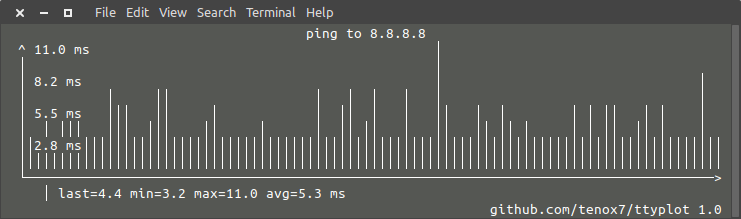
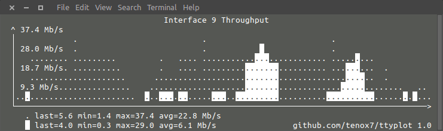

ttyplot
=======
a realtime plotting utility for terminal with data input from stdin

takes data from stdin, most commonly unix pipeline and plots in text mode on a terminal or console,
supports rate calculation for counters and up to two plos on a single display using reverse video for second line







usage examples
==============

### cpu usage from vmstat
```
vmstat -n 1 | gawk '{ print 100-int($(NF-2)); fflush(); }' | ttyplot 
```

### cpu usage from sar with title and fixed scale to 100%
```
sar 1 | gawk '{ print 100-int($NF); fflush(); }' | ttyplot -s 100 -t "cpu usage" -u "%"
```

### memory usage from sar
```
sar -r 1 | gawk '{ print $5; fflush(); }' | ttyplot -s 100 -t "memory used %" -u "%" 
```

### ping plot
```
ping 8.8.8.8 | gawk '{ gsub(/time=/,"",$(NF-1)); print $(NF-1); fflush(); }' | ttyplot -t "ping to 8.8.8.8" -u ms
```

### local network throughput for all interfaces from sar using two lines
```
sar  -n DEV 1 | gawk '{ if($6 ~ /rxkB/) { print iin/1000; print out/1000; iin=0; out=0; fflush(); } iin=iin+$6; out=out+$7; }' | ttyplot -2 -u "MB/s"
```

### snmp network throughput for an interface using [ttg](https://github.com/tenox7/ttg) and two lines plot
```
ttg -i 10 -u Mb 10.23.73.254 public 9 | gawk 'BEGIN { getline; } { print $5,$8; fflush(); }' | ttyplot -2 -u Mb/s
```

### snmp network throughput for an interface using snmpdelta with two lines plot
```
snmpdelta -v 2c -c public -Cp 10 10.23.73.254 1.3.6.1.2.1.2.2.1.10.9  1.3.6.1.2.1.2.2.1.16.9 | gawk '{ print $NF/1000/1000/10; fflush(); }' | ttyplot -t "ifindex 9 throughput" -u Mb/s
```

### disk throughput from iostat 
```
iostat -xmy 1 | gawk '/^nvme0n1/ { print $4,$5; fflush(); }' | ttyplot -2 -t "nvme0n1 throughput" -u MB/s
```

### cpu temperature from proc
```
{ while true; do gawk '{ printf("%.1f\n", $1/1000); fflush(); }' /sys/class/thermal/thermal_zone0/temp; sleep 1; done } | ttyplot -t "cpu temp" -u C
```

### fan speed from lm-sensors
```
{ while true; do sensors | gawk '/^fan1:/ { print $2; fflush(); }'; sleep 1; done } | ttyplot -t "fan speed" -u RPM
```

### prometheus remote load average via node exporter
```
{ while true; do curl -s  http://10.4.7.180:9100/metrics | gawk '/^node_load1 / { print $2; fflush(); }'; sleep 1; done } | ttyplot
```

### bitcoin price chart
```
{ while true; do curl -sL https://coinbase.com/api/v1/prices/historical | head -1 | cut -d, -f2 ; sleep 600; done } | ttyplot -t "bitcoin price" -u usd
```

### stock quote chart
```
{ while true; do curl -s https://api.iextrading.com/1.0/stock/googl/price | gawk '{ print $1; fflush(); }'; sleep 600; done } | ttyplot -t "google stock price" -u usd
```


rate calculator for counters 
============================

ttyplot supports calculating rate on "counter" style metrics, the rate is divided by measured time difference between samples

### snmpget counter rate for interface in MB/s using two plot lines
```
{ while true; do snmpget  -v 2c -c public  10.23.73.254  1.3.6.1.2.1.2.2.1.10.9 1.3.6.1.2.1.2.2.1.16.9 | gawk '{ print $NF/1000/1000; fflush(); }'; sleep 10; done } | ttyplot -2 -r -u "MB/s"
```

### prometheus node exporter disk throughput for sda device using two lines 
```
{ while true; do curl -s http://10.11.0.173:9100/metrics | gawk '/^node_disk_.+_bytes_total{device="sda"}/ { printf("%f\n", $2/1024/1024); fflush(); }'; sleep 1; done } | ttyplot -r -2 -u MB/s -t "10.11.0.173 sda writes"
```


options
=======

```
ttyplot [-r] [-c plotchar] [-s softmax] [-m hardmax] [-t title] [-u unit]

-2 read two values and draw two plots, the second one is in reveverse video

-r calculate counter rate and divide by measured sample interval

-c character to use for plot line, eg @ # % . etc

-s softmax is an initial maximum value that can grow if data input has larger value

-m hardmax is a hard maximum value that can never grow, 
   if data input has larger value the plot line will not be drawn

-t title of the plot

-u unit displayed beside vertical bar
```


stdio buffering
===============
by default stdio is buffered, you can work around it in [various ways](http://www.perkin.org.uk/posts/how-to-fix-stdio-buffering.html) 
